# Active Directory IAM Joiner-Mover-Leaver Lab


## Project Overview


Built a Windows Server 2025 Active Directory lab using VMware Workstation to practice Identity and Access Management (IAM) lifecycle operations.


The project demonstrates a complete Joiner-Mover-Leaver (JML) workflow using Active Directory Users and Computers and PowerShell verification.


## Lab Environment


- VMware Workstation Pro

- Windows Server 2025

- Active Directory Domain Services (AD DS)

- DNS Server

- Domain: gcyber.test

- Domain Controller: DC01

- DC01 IP Address: 192.168.15.10


## Active Directory Structure


Created a structured Organizational Unit (OU) design:


- Users

&#x20; - HR

&#x20; - Finance

&#x20; - Sales

&#x20; - IT

- Groups

- Computers

- Service Accounts

- Disabled Users


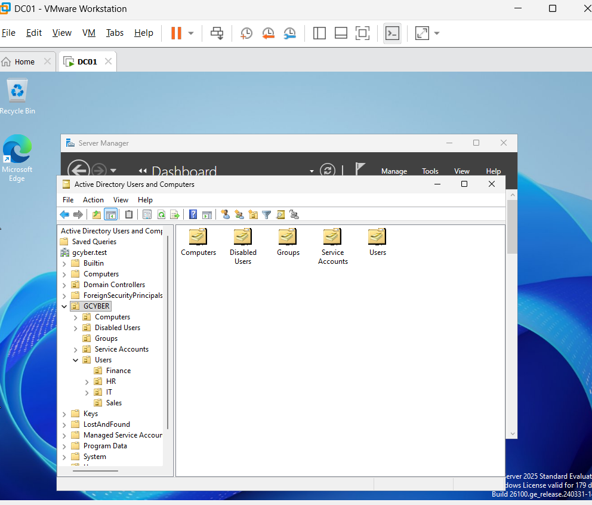


## Security Groups


Created Global Security Groups for department-based access management:


- GG\_HR\_Users

- GG\_Finance\_Users

- GG\_Sales\_Users

- GG\_IT\_Users


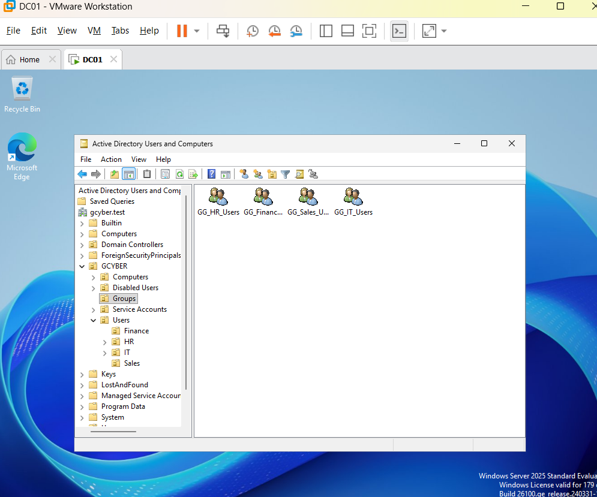


## Joiner Scenario


Created a fictional employee:


**Sarah Lee**


Initial department:


**Sales**


Actions performed:


1. Created the user account `sarah.lee`

2. Placed the account in the Sales OU

3. Assigned membership to `GG\_Sales\_Users`

4. Configured password change at next logon

5. Verified group membership using PowerShell


## Mover Scenario


Sarah Lee transferred from Sales to Finance.


Actions performed:


1. Moved Sarah from the Sales OU to the Finance OU

2. Removed `GG\_Sales\_Users`

3. Added `GG\_Finance\_Users`

4. Verified the new group membership with PowerShell


This demonstrated the principle of least privilege by removing obsolete access before retaining only the permissions required for the new role.


## Leaver Scenario


Sarah Lee was offboarded.


Actions performed:


1. Disabled the user account

2. Removed Finance security-group access

3. Moved the account to the Disabled Users OU

4. Retained the identity for audit and administrative purposes

5. Verified that the account was disabled

6. Verified that only the default Domain Users membership remained


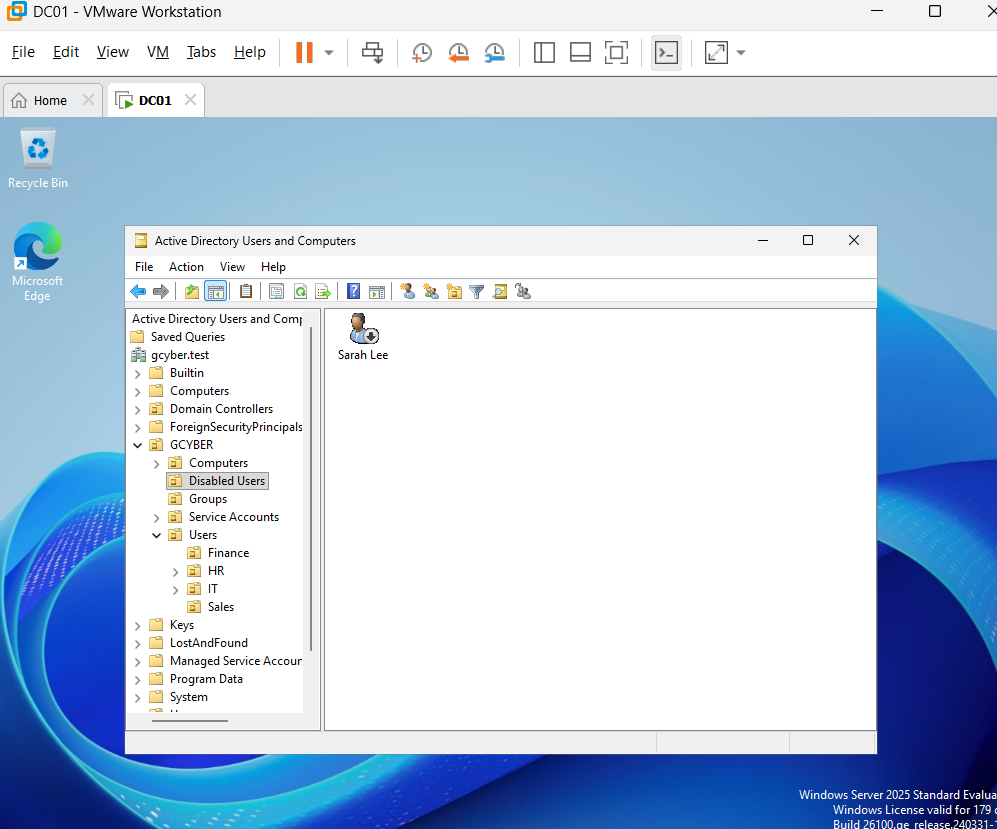


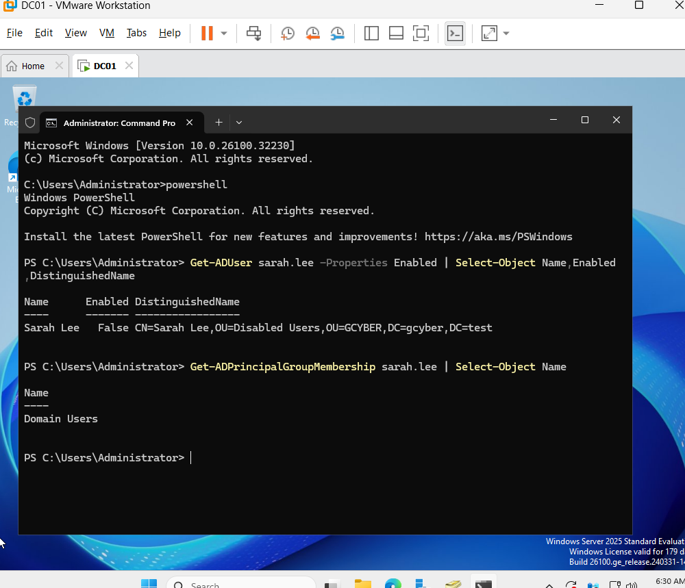


## PowerShell Verification


Examples used during the project:


```powershell

Get-ADPrincipalGroupMembership sarah.lee | Select-Object Name


Get-ADUser sarah.lee -Properties Enabled |

Select-Object Name,Enabled,DistinguishedName

```


## AGDLP Role-Based File Access
Implemented department-based access control using the **AGDLP** model:

**Accounts → Global Groups → Domain Local Groups → Permissions**

### Access Design

- Finance: `GG_Finance_Users` → `DL_Finance_RW` → Finance Share
- Sales: `GG_Sales_Users` → `DL_Sales_RW` → Sales Share
- HR: `GG_HR_Users` → `DL_HR_RW` → HR Share
- IT: `GG_IT_Users` → `DL_IT_RW` → IT Share

Users were assigned to department-based Global Groups. These groups were nested into Domain Local groups, and permissions were assigned to the Domain Local groups instead of directly to individual users.

This demonstrates scalable role-based access control and the principle of least privilege.

### Access Validation

- Finn Test → Finance access authorized
- Sally Test → Sales access authorized
- Hannah Test → HR role membership verified
- Ian Test → IT access authorized
- Cross-department access attempts were denied

### Evidence

#### Authorized Finance Access

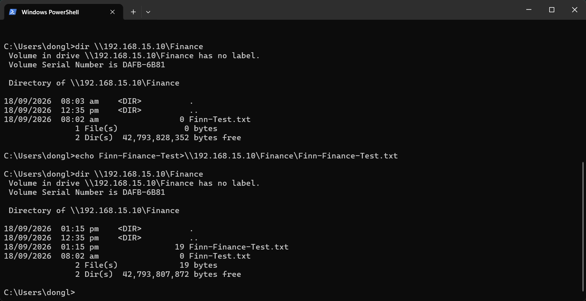

#### Finance Share Permission

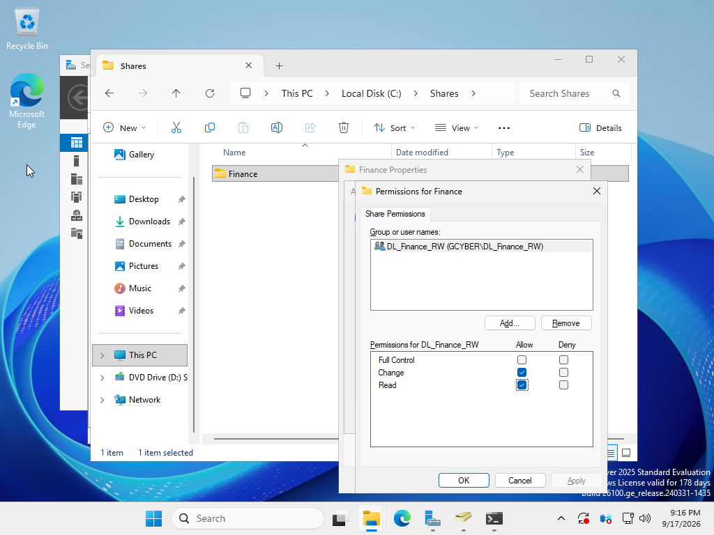

#### Effective Nested Membership

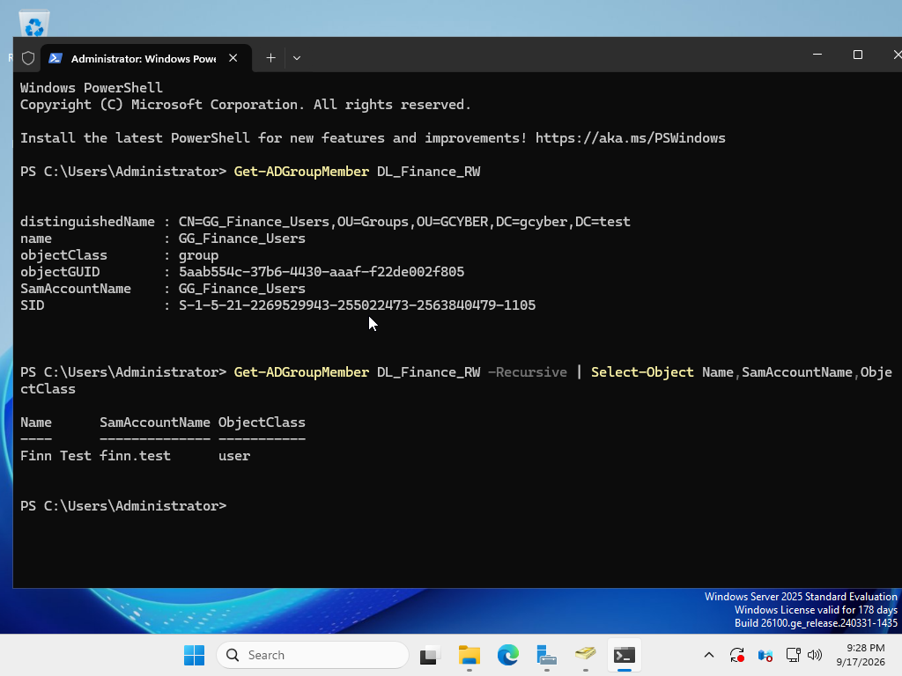

#### Cross-Department Access Denied

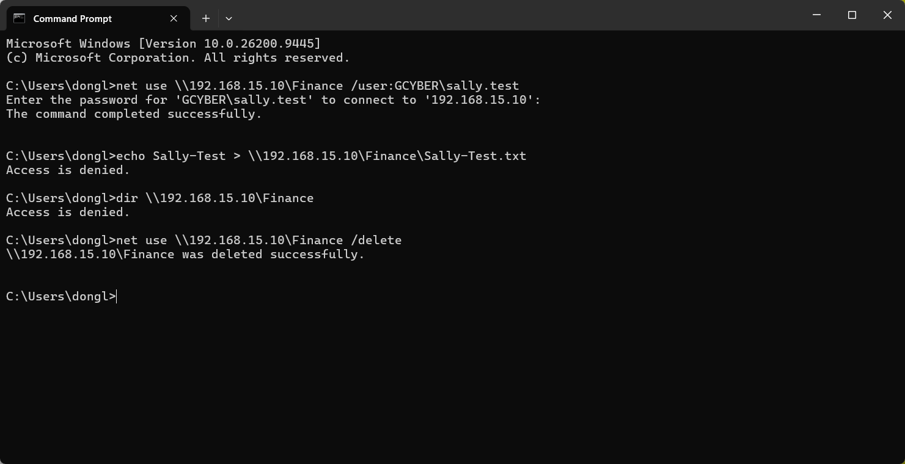

#### Authorized Sales Access

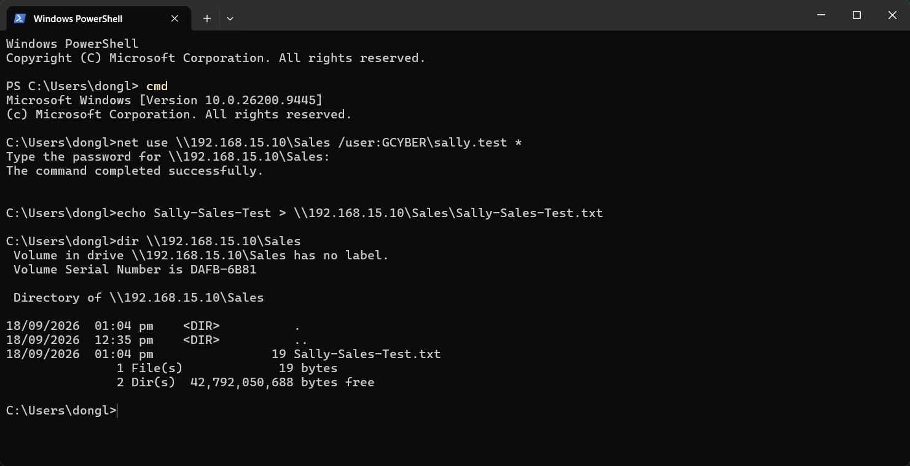

### Verification Commands

```

Get-ADPrincipalGroupMembership username | Select-Object Name

Get-ADGroupMember GroupName -Recursive |
Select-Object Name,SamAccountName,ObjectClass

Get-SmbShareAccess -Name ShareName

Get-SmbShare
```

## Jira IAM Service Desk Operations Lab

Expanded the Active Directory IAM environment into a ticket-driven service desk workflow using Jira Service Management.

The lab simulated common Identity and Access Management operational requests and followed a consistent workflow:

Request → Validate → Investigate/Change → Verify → Document → Customer Update → Resolve

### IAM Service Desk Scenarios

#### 1. Joiner - New Hire Access Provisioning

Provisioned and validated Finance access for a new employee using the existing Active Directory and AGDLP access-control structure.

- Verified the user account
- Assigned the appropriate Finance security-group membership
- Confirmed effective access through the nested AGDLP model
- Performed functional read/write testing
- Documented and resolved the Jira request

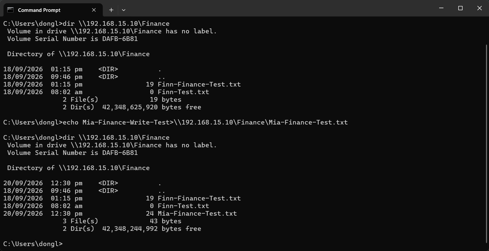

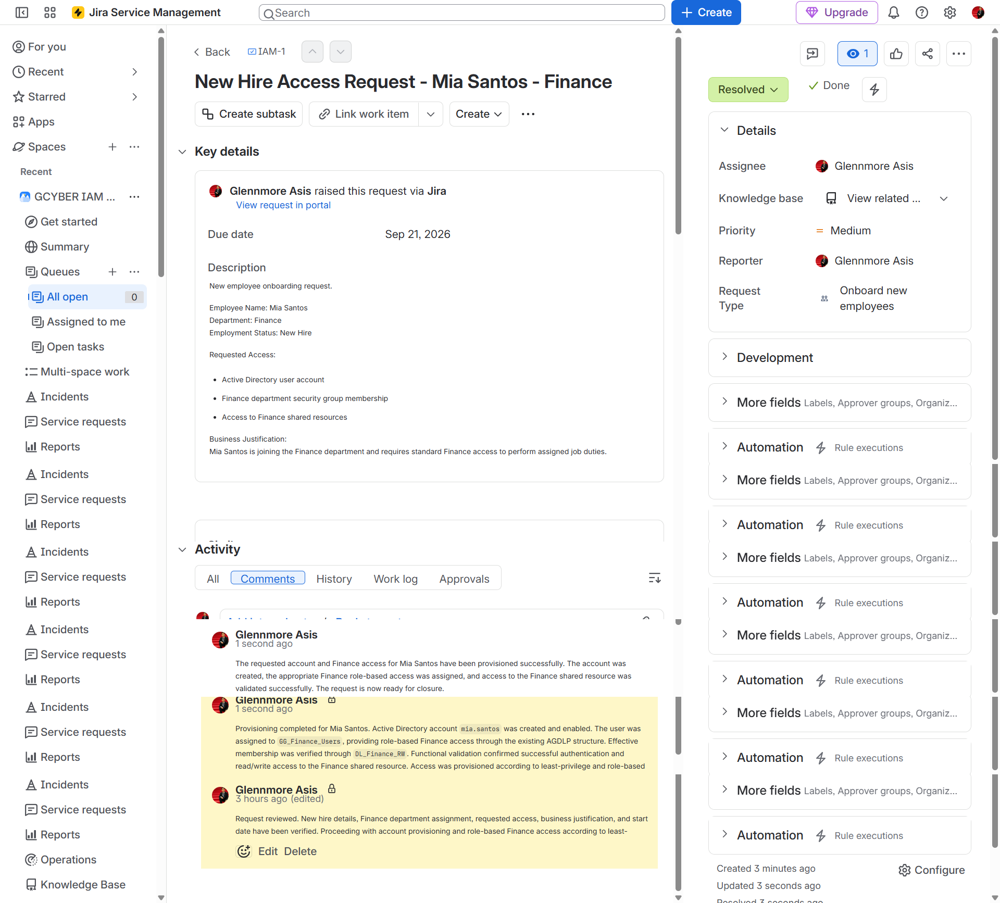

#### 2. Password Lockout and Account Recovery

Investigated a user sign-in issue caused by an Active Directory account lockout.

- Verified the correct user account
- Confirmed the account lockout condition
- Restored account access using a controlled unlock and password reset
- Performed post-change authentication and resource-access validation
- Documented the technical work and resolved the request

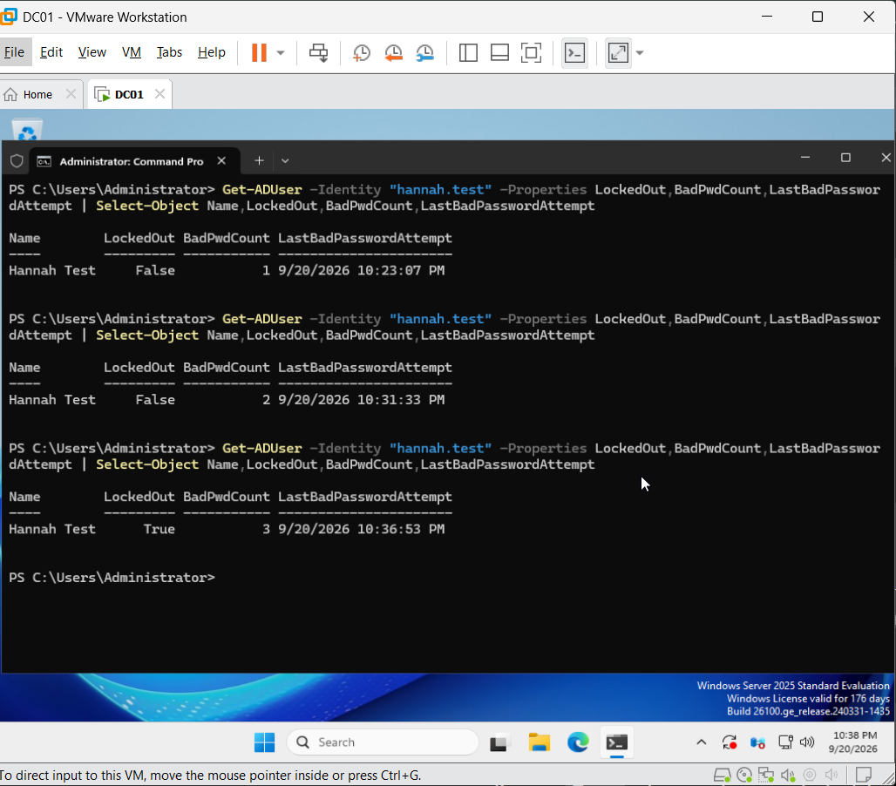

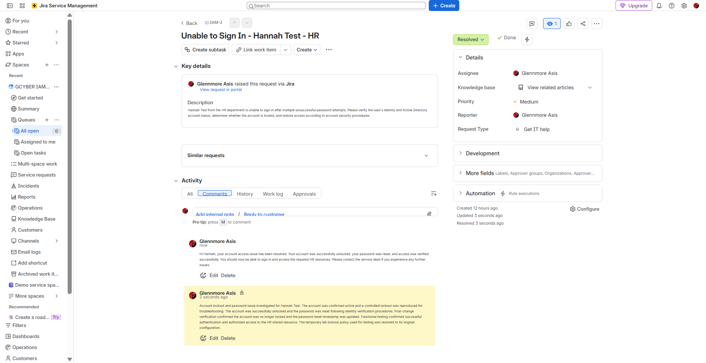

#### 3. Mover - Department Transfer

Processed an employee transfer from HR to Finance while maintaining least-privilege access.

- Removed the previous HR role membership
- Assigned the Finance role membership
- Verified the employee was no longer an effective member of the HR access group
- Confirmed effective Finance access through the AGDLP structure
- Tested removal of old access and successful access to the new department resource
- Documented and resolved the Jira request

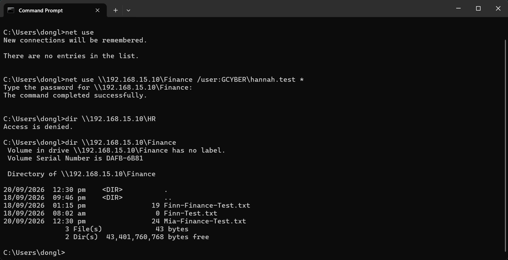

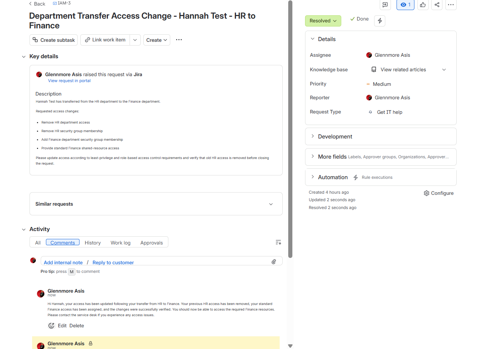

#### 4. Leaver - Employee Offboarding

Performed controlled offboarding for an IT department employee.

- Verified the Active Directory account and existing role membership
- Disabled the user account
- Removed IT security-group membership
- Confirmed removal of effective access through DL_IT_RW
- Performed functional authentication testing
- Verified that the disabled account could no longer sign in
- Documented and resolved the Jira request

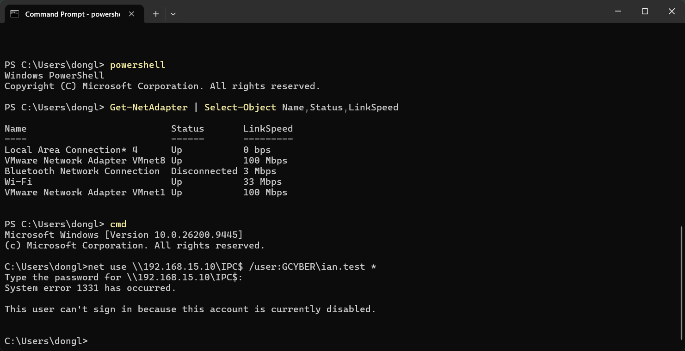

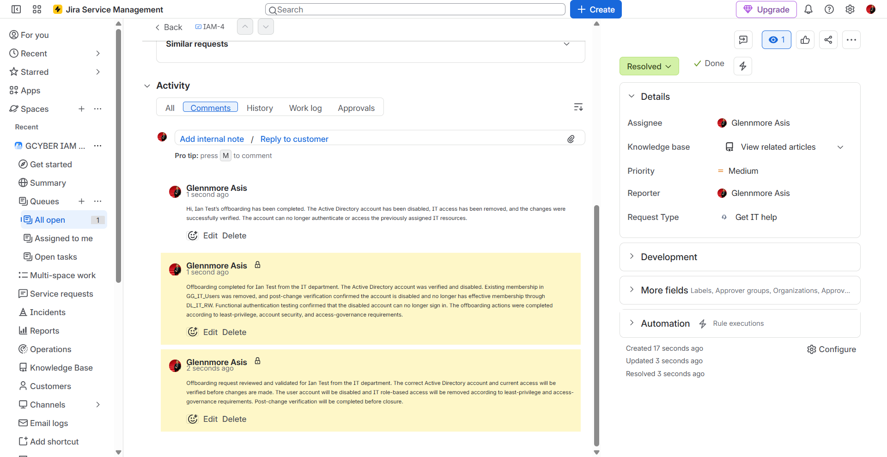

#### 5. Access Denied Investigation

Investigated a reported Sales shared-folder access issue without making unnecessary permission changes.

The following access path was verified:

User Account → Global Group → Domain Local Group → SMB Share → NTFS Permissions → Functional Access

Investigation confirmed:

- Sally Test's account was active
- GG_Sales_Users membership was correct
- Effective DL_Sales_RW membership was present
- SMB share permission allowed Change access
- NTFS permission allowed Modify access
- Authentication succeeded
- Read/list access succeeded
- Write/create access succeeded

The reported access-denied condition could not be reproduced during controlled testing, so no additional permission changes were made.

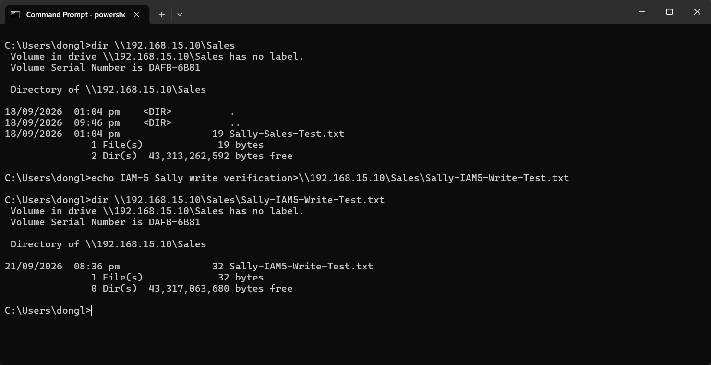

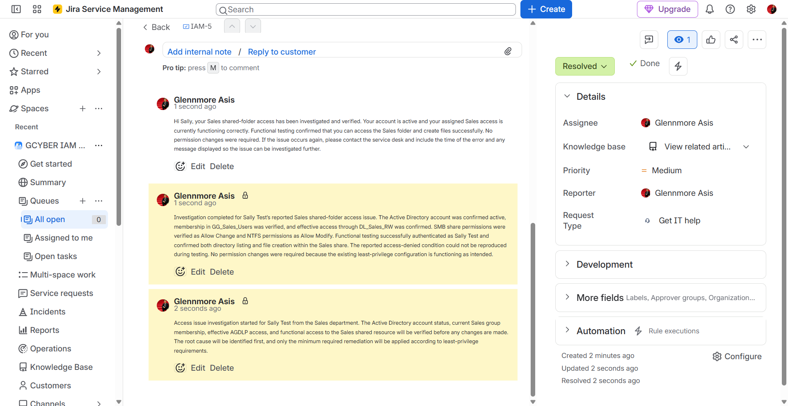

### Key IAM Skills Demonstrated

- Active Directory user lifecycle management
- Joiner-Mover-Leaver operations
- Account lockout and password recovery
- RBAC and AGDLP access management
- Least-privilege administration
- Security-group membership management
- SMB and NTFS permission validation
- Authentication vs authorization troubleshooting
- Functional access testing
- Access-denied investigation
- Jira Service Management ticket handling
- Technical documentation and customer communication
- Post-change verification and ticket closure
